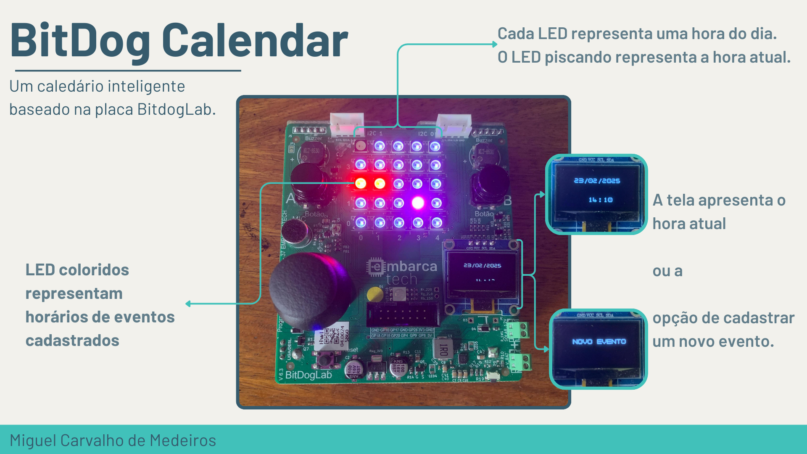

[Vídeo de Apresentação](https://youtube.com/shorts/Yz97WCfgbEI)

## Descrição

O projeto visa criar um sistema de calendário autónomo com funcionalidades de visualização da hora e data, agendamento de eventos, e interação através de uma matriz de LEDs, um display OLED, botões físicos e um joystick analógico.

[Documentação](docs)

## Link para o Source do Projeto
[https://github.com/Miguel-MCM/BitDogCalendar](https://github.com/Miguel-MCM/BitDogCalendar)

## Conteúdo

* [Descrição](#descrição)
* [Link para o Source do Projeto](#link-para-o-source-do-projeto)
* [Conteúdo](#conteúdo)
* [Objetivos do Projeto](#objetivos-do-projeto)
* [Lista de Materiais e Conexões](#lista-de-materiais-e-conexões)
* [Como Começar](#como-começar)
    * [Pré-requisitos](#pré-requisitos)
    * [Construindo o Projeto](#construindo-o-projeto)
    * [Realizando o Flash para a Pico](#realizando-o-flash-para-a-pico)
* [Próximos Passos e Melhorias Futuras](#próximos-passos-e-melhorias-futuras)
* [Contribuindo](#contribuindo)
* [Licença](#licença)

## Objetivos do Projeto

- Desenvolver um sistema de calendário eletrônico funcional.
- Implementar uma interface de usuário intuitiva para marcação de eventos e configuração
 de alarmes.
- Integrar funcionalidades de alarme sonoro e/ou visual para notificação de eventos.
- Criar um projeto de código aberto, documentado e de fácil reprodução

## Lista de Materiais e Conexões

| Nome | Componente | Pino da Pico W | Descrição da Conexão |
|------|------------|----------------|----------------------|
| Botão A | Chave Táctil | GPIO5 | Entrada digital para confirmação e seleção (com resistor de pull-up) |
| Botão B | Chave Táctil | GPIO6 | Entrada digital para negação e retrocesso (com resistor de pull-up) |
| Matriz de LEDs RGB 5x5| WS2812 | GP7 |  Saída digital para controle da matriz de LEDs via PIO|
| Display OLED | SSD1306 12C 128x64 | GP20 (SDA) e GP21 (SCL) | Comunicação I2C para o display OLED |
| Joystick | Joystick Analógico | GP 26 (ADC0) e GP27 (ADC1) | Eixos **X** e **Y** do joystick, respectivamente |
| Buzzer | Buzzer | GP22 | Saída PWM para controle do buzzer |

* Já se assume a devida conexão de Ground e VCC, para os que requerem
 alimentação, dos componentes.

## Como Começar

Siga estas instruções para configurar o ambiente de desenvolvimento e executar o projeto no seu Raspberry Pi Pico.

### Pré-requisitos

Certifique-se de que tem as seguintes ferramentas instaladas:

* **SDK do Raspberry Pi Pico:** O ambiente de desenvolvimento para o RP2040. Consulte o [Guia de Início Rápido do Raspberry Pi Pico](https://www.raspberrypi.com/documentation/microcontrollers/c_sdk.html#getting-started) para obter instruções de instalação.
* **CMake:** Uma ferramenta de construção cross-platform.
* **Um compilador ARM GCC:** Necessário para compilar o código para o RP2040. Geralmente incluído com a SDK do Pico.
* **Python 3:** Necessário para algumas ferramentas da SDK do Pico.
* **picotool:** Uma ferramenta para interagir com o Pico (incluída na SDK).
### Construindo o Projeto

1.  Clone este repositório para a sua máquina local:
    ```bash
    git clone https://github.com/Miguel-MCM/BitDogCalendar
    cd BitDogCalendar
    ```

2.  Crie um diretório de build:
    ```bash
    mkdir build
    cd build
    ```

3.  Configure o build utilizando o CMake, certificando-se de que a variável `PICO_SDK_PATH` esteja corretamente definida para o local da sua instalação da SDK do Pico:
    ```bash
    export PICO_SDK_PATH="/caminho/para/a/sua/pico-sdk" # Substitua pelo seu caminho real
    cmake ..
    ```
    Se estiver a usar o Windows, poderá precisar de usar uma sintaxe diferente para definir a variável de ambiente.

4.  Compile o projeto:
    ```bash
    make -j4
    ```

   Isto irá gerar os ficheiros binários necessários, incluindo o ficheiro `.uf2` que será usado para realizer o flash para a Pico.

### Realizando o Flash para a Pico

1.  Certifique-se de que o seu Raspberry Pi Pico não está ligado ao computador.
2.  Mantenha o botão `BOOTSEL` no seu Pico pressionado enquanto o conecta ao seu computador via USB. Isto irá montar o Pico como um disco removível chamado `RPI-RP2`.
3.  Copie o ficheiro `.uf2` encontrado no diretório `build` (normalmente com o nome do projeto, ex: `BitDogCalendar.uf2`) para o disco `RPI-RP2`.
4.  O Pico irá reiniciar automaticamente e começar a executar o código.

## Próximos Passos e Melhorias Futuras

* Implementar persistência de dados para os eventos (utilizando memória Flash).
* Melhorar a interface de utilizador no display OLED com mais opções e informações.
* Adicionar funcionalidades de alarme mais avançadas (recorrência, sons diferentes).
* Implementar modos de economia de energia para prolongar a vida útil da bateria.
* Integrar conectividade WiFi para sincronização de tempo via NTP e/ou sincronização com calendários online.
* Criar uma interface web para gerir o calendário remotamente.

## Contribuindo

Contribuições são bem-vindas! Se tiver alguma sugestão de melhoria, correção de bugs ou novas funcionalidades, sinta-se à vontade para abrir um "issue" ou enviar um "pull request". Por favor, siga as convenções de codificação e documentação existentes.

## Licença

[GPL-3.0 license](LICENSE)
